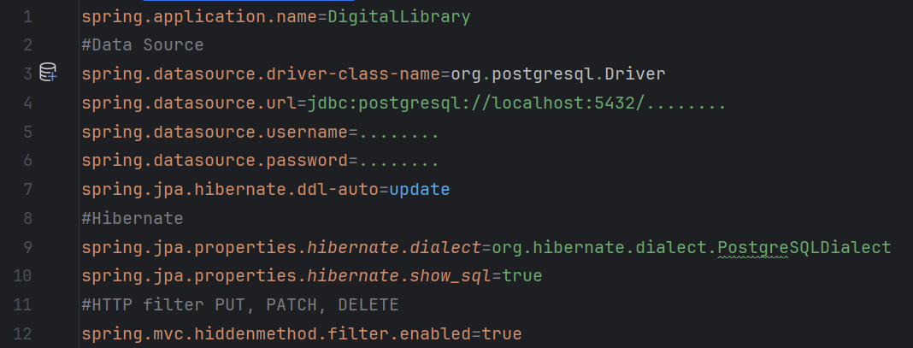

# Проект "Электронная библиотека"
Проект представляет из себя реализацию web-приложения библиотеки, переходящей на цифровой учёт книг.

Состоит из 4-х релизов:

1) Связь с БД через JDBC Template (Spring Template). Запуск через Tomcat.
2) Связь с БД через Spring Data JPA. Запуск через Tomcat.
3) Связь с БД через Spring Data JPA. Запуск через Tomcat.
4) Связь с БД через Spring Data JPA. Запуск через Spring Boot.

## Стек
<div>
  &nbsp;
  &nbsp;
  &nbsp;
  &nbsp;
  
  &nbsp;
</div>

## Использование
Приложение подразумевает взаимодействие со следующими URL:
```
http://localhost:8080/people
http://localhost:8080/books
http://localhost:8080/books/search ~ v1.2.0+
http://localhost:8080/books?sort_by_year=true  ~ v1.2.0+
http://localhost:8080/books?page=0&books_per_page=6  ~ v1.2.0+
http://localhost:8080/books?page=0&books_per_page=6&sort_by_year=true  ~ v1.2.0+
```
## Функционал
- Выполнение CRUD-функций над читателями и книгами
- Назначение книг читателям
- Освобождение книг у читателей
- Просмотр имеющихся у читателей книг
- Пагинация ```~ v1.2.0+```
- Сортировка книг по дате выпуска ```~ v1.2.0+```
- Поиск всех имеющихся книг в библиотеке ```~ v1.2.0+```
- Визуальное представление пагинации  ```~ v1.3.0+```
- Контроль просроченности по времянахождению у читателя взятой книги ```~ v1.3.0+```
    
## Инструкция по сборке и запуску решения
- Сделать `git clone` репозитория

#### Для версии v2.0.0+
- В разделе `resources` добавить в файл `application.properties` значения ключей.


## Операции с базой данных
- Создать в базе данных 2 таблицы:
```
CREATE TABLE Person
(
    person_id     int GENERATED BY DEFAULT AS IDENTITY PRIMARY KEY,
    full_name     varchar(120) UNIQUE                NOT NULL,
    year_of_birth int CHECK ( year_of_birth > 1900 ) NOT NULL
);
CREATE TABLE Book
(
    book_id   int GENERATED BY DEFAULT AS IDENTITY PRIMARY KEY,
    person_id int          REFERENCES Person (person_id) ON DELETE SET NULL,
    title     varchar(240) NOT NULL,
    author    varchar(120) NOT NULL,
    year_of_release int NOT NULL
);
```
#### Для версии v1.3.0+
- Дополнительно выполнить:
```
ALTER TABLE book ADD COLUMN taken_at TIMESTAMP
```
